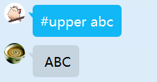
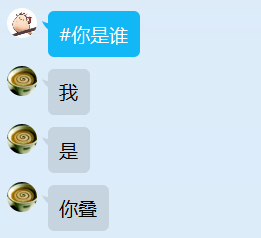
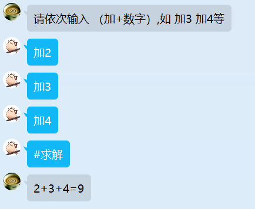
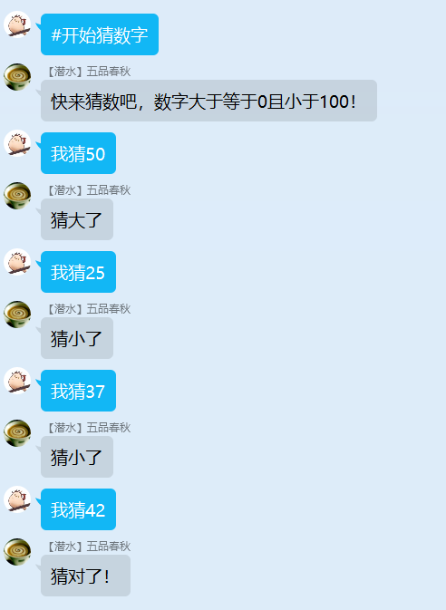

# 0.安装

Python==3.8.8

**nodejs:**

​	@grpc/grpc-js==1.6.8

​	@grpc/proto-loader==0.7.0

**python:**

​	grpcio==1.48.0

​	googleapis-common-protos==1.56.4

​	

# 1.交互格式

## 1.1 Request

```protobuf
message Request {
    Event event = 1;
    string file = 2;
    string function = 3;
    map<string, string> message = 4;
    map<string, Image> image = 5;
    map<string, Other> other = 6;
}
```

event：包含发送者的qq，昵称、群qq号，待完善。可不填

file：必填。指定apps/py/中哪个文件处理消息。与function缺一不可

function：必填。指定file中哪一个函数处理消息。与file缺一不可

message：键值均为字符串的字典，用来传递字符串消息。可不填

image：键为字符串、值为bytes的字典，用来传递图片，待完善。可不填

other：键为字符串、值为bytes的字典，用来传递其它二进制数据，待完善。可不填

## 1.2 Response

```protobuf
message Response {
    map<string, string> message = 1;
    map<string, Image> image = 2;
    map<string, Other> other = 3;
}
```

定义与Request相同

# 2.接口

提供了nodejs调用python的四个接口

## 2.1 UnaryToUnary

流程：用户发一条消息，服务端响应一条消息



最为主要的调用方式

```js
export async function upper(e) {
  client.UnaryToUnary({
    file: "example_UnaryToUnary", //指定example_UnaryToUnary.py
    function: "upper",//指定upper函数
    message: {
      raw: e.msg.replace("#upper", ""),//将消息去掉#upper后发送给example_UnaryToUnary.py的upper函数处理。消息位于message.raw
    },
  }, (err, response) => {
    if (err) {
      console.error("Error: ", err);
    } else {
      e.reply(response.message.upper);//接收到结果后返回。消息位于message.upper
    }
  });
}

export async function lower(e) {
  client.UnaryToUnary({
    file: "example_UnaryToUnary",//指定example_UnaryToUnary.py
    function: "lower",//指定lower函数
    message: {
      raw: e.msg.replace("#lower", ""),
    },
  }, (err, response) => {
    if (err) {
      console.error("Error: ", err);
    } else {
      e.reply(response.message.lower);
    }
  });
}
```

```python
def upper(request):
    return {
        "message": {
            "upper": request.message.get("raw").upper()#将消息放在message.upper后返回
        }
    }


def lower(request):
    return {
        "message": {
            "lower": request.message.get("raw").lower()#将消息放在message.lower后返回
        }
    }

```

## 2.2 UnaryToStream

用户发送一条消息，服务端依次返回一系列消息



```js
export async function who(e) {
  let call = client.UnaryToStream({
    file: "example_UnaryToStream",//指定example_UnaryToStream.py
    function: "who",//指定who函数
  });

  call.on("data", function(response) {
    e.reply(response.message.res);//监听服务端，有消息就返回
  });
}
```

```python
config = {
    "type": "UnaryToStream"#注意指定who函数为UnaryToStream函数，不写默认为UnaryToUnary函数
}

#UnaryToStream函数为生成器
def who(request):
    yield {
        "message": {
            "res": "我"
        }
    }
    time.sleep(1)
    yield {
        "message": {
            "res": "是"
        }
    }
    time.sleep(1)
    yield {
        "message": {
            "res": "你叠"
        }
    }
```

## 2.3 StreamToUnary

用户发送一系列信息，发送完成后告诉服务端，服务端在用户发送完成后返回数据



```js
export const rule = {
  startAdd: {
    reg: "^#开始计算",
    priority: 800,
    describe: "开始累加计算",
  },
  addNum: {
    reg: "^加[0-9]+",
    priority: 800,
    describe: "开始累加",
  },
  showRes: {
    reg: "^#求解",
    priority: 800,
    describe: "返回结果",
  },
};

let current = {};

export async function startAdd(e) {
  if (e.isGroup) {
    return;
  }

  if (current[e.user_id]) {
    e.reply("计算进行中!");
    return;
  }

  current[e.user_id] = client.StreamToUnary((error, response) => {
    //回调函数在用户结束发送时触发
    if (error) {
      console.log(error);
    } else {
      e.reply(response?.message?.res ?? "已结束");
    }
  });

  e.reply("请依次输入 （加+数字）,如 加3 加4等");
}

export async function addNum(e) {
  let call = current[e.user_id];

  if (!call) {
    e.reply("计算未开始!");
    return;
  }

  call.write({
    file: "example_StreamToUnary",
    function: "add",
    message: {
      num: e.msg.replace("加", ""),
    },
  });
}


export async function showRes(e) {
  let call = current[e.user_id];

  if (!call) {
    e.reply("计算未开始!");
    return;
  }

  call.end();//用户结束发送，之后服务端返回结果
  delete current[e.user_id];
}
```

```python
config = {
    "type": "StreamToUnary"#指定add为StreamToUnary函数
}

#head为用户发送的第一天信息，request_iterator为迭代器，可获取用户之后的消息
def add(head, request_iterator):
    nums = [int(head.message.get("num"))]
    for i in request_iterator:
        nums.append(int(i.message.get("num")))
    return {
        "message": {
            "res": f"{'+'.join(map(str, nums))}={sum(nums)}"
        }
    }

```

## 2.4 StreamToStream

用户发送一条消息，服务端返回一条消息，直至一方主动终止



```js
export const rule = {
  startGuessNum: {
    reg: "^#开始猜数字",
    priority: 800,
    describe: "开始猜数字游戏",
  },
  GuessNum: {
    reg: "^我猜[0-9]+",
    priority: 800,
    describe: "猜数",
  },
  stopGuessNum: {
    reg: "^#不猜了",
    priority: 800,
    describe: "结束",
  },
};
let current = {};

export async function startGuessNum(e) {
  if (!e.isGroup) {
    e.reply("只能在群聊中玩猜数游戏");
    return;
  }

  if (current[e.group.group_id]) {
    e.reply("猜数游戏进行中");
    return;
  }

  let call = client.StreamToStream();
  current[e.group.group_id] = call;
  e.reply("快来猜数吧，数字大于等于0且小于100！");

  call.on("data", response => {
    //监听服务端消息，根据是否猜对进行相应的处理
    if (response.message.correct === "true") {
      e.reply("猜对了！");
      call.end()//客户端主动关闭
      delete current[e.group.group_id]
    }else {
      e.reply(response.message.res);
    }
  });

}

export async function GuessNum(e) {
  if (!e.isGroup) {
    e.reply("只能在群聊中玩猜数游戏");
    return;
  }

  let call = current[e.group.group_id];
  if (!call) {
    e.reply("猜数游戏未开始");
    return;
  }

  call.write({
    //发送猜的数，注意指定py文件和函数
    file: "example_StreamToStream",
    function: "guess",
    message: {
      num: e.msg.replace("我猜", ""),
    },
  });
}

export async function stopGuessNum(e) {
  if (!e.isGroup) {
    e.reply("只能在群聊中玩猜数游戏");
    return;
  }

  let call = current[e.group.group_id];
  if (!call) {
    e.reply("猜数游戏未开始");
    return;
  }

  call.end();//用户主动关闭
  delete current[e.group.group_id]
  e.reply("已结束");
}
```

```python
config = {
    "type": "StreamToStream"#指定guess函数为StreamToStream函数
}

#StreamToStream参数是生成器，返回值也是生成器
def guess(head, request_iterator):
    #head为第一条信息，request_iterator为之后的消息
    num = random.randint(0, 100)
    guessNum = int(head.message.get("num"))

    if guessNum == num:
        yield {
            "message": {
                "res": "猜对了！",
                "correct": "true"
            }
        }
        return

    else:
        yield {
            "message": {
                "res": f"猜{'大' if guessNum > num else '小'}了",
            }
        }

    for i in request_iterator:
        guessNum = int(i.message.get("num"))
        if guessNum == num:
            yield {
                "message": {
                    "res": "猜对了！",
                    "correct": "true"
                }
            }
            return

        else:
            yield {
                "message": {
                    "res": f"猜{'大' if guessNum > num else '小'}了",
                }
            }

```

