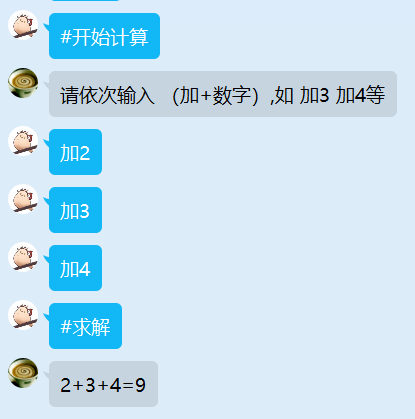

# 0.安装

Python==3.8.8

**nodejs:**

​	@grpc/grpc-js

​	@grpc/proto-loader

**python:**

​	grpcio

​	googleapis-common-protos

可在config中配置python解释器路径、rpc地址

```json
{
  "version": [1,0,0],
  "pythonPath": "python",
  "host": "127.0.0.1",
  "port": "50051"
}
```

# 1.交互格式

## 1.1 Request

```protobuf
message Request {
    Event event = 2;
    string file = 3;
    string function = 4;
    map<string, string> message = 5;
    map<string, Image> image = 6;
    map<string, Other> other = 7;
}

message Event {
    User sender = 1;
    int32 group_qq = 2;
}

message User {
    int32 user_qq = 1;
    string nickname = 2;
}

message Image {
    bytes binary = 1;
    string format = 2;
}

message Other {
    bytes binary = 1;
    map<string, string> context = 2;
}
```

event：包含发送者的qq，昵称、群qq号，待完善。

file：指定apps/py/中哪个文件处理消息。

function：指定file中哪一个函数处理消息。

message：键值均为字符串的字典，用来传递字符串消息。

image：键为字符串、值为Image的字典，用来传递图片，待完善。

other：键为字符串、值为Other的字典，用来传递其它二进制数据，待完善。

## 1.2 Response

```protobuf
message Response {
    map<string, string> message = 1;
    map<string, Image> image = 2;
    map<string, Other> other = 3;
}
```

定义与Request相同

# 2.接口

提供了nodejs调用python的四个接口

## 2.1 UnaryToUnary

流程：用户发一条消息，服务端响应一条消息


最为主要的调用方式

```js
//example_UnaryToUnary.js
import { UnaryToUnary } from "../../core/client/client.js";


export const rule = {
  upper: {
    reg: "^#upper",
    priority: 800,
    describe: "返回大写",
  },
  lower: {
    reg: "^#lower",
    priority: 800,
    describe: "返回小写",
  },
};

export async function upper(e) {
  UnaryToUnary({
    file: "example_UnaryToUnary",
    func: "upper",
    load: {
      message: {
        raw: e.msg.replace("#upper", ""),
      },
    },
    onData: (err, response) => {
      if (err) {
        e.reply("出错了!");
        console.error(err);
      } else {
        e.reply(response.message.upper);
      }
    },
  });
  return true;
}

export async function lower(e) {
  UnaryToUnary({
    file: "example_UnaryToUnary",
    func: "lower",
    load: {
      message: {
        raw: e.msg.replace("#lower", ""),
      },
    },
    onData: (err, response) => {
      if (err) {
        console.error(err);
        e.reply("出错了!");
      } else {
        e.reply(response.message.lower);
      }
    },
  });
  return true;
}
```

```python
#example_FrameToFrame.py
from core.lib.decorator import channel


@channel.uu
def upper(request):
    return {
        "message": {
            "upper": request.message.get("raw").upper()
        }
    }


@channel.uu
def lower(request):
    return {
        "message": {
            "lower": request.message.get("raw").lower()
        }
    }
```

## 2.2 UnaryToStream

用户发送一条消息，服务端依次返回一系列消息


```js
//example_UnaryToStream.js
import { UnaryToStream } from "../../core/client/client.js";


export const rule = {
  who: {
    reg: "^#你是谁",
    priority: 800,
    describe: "你是谁",
  },
};

export async function who(e) {
  UnaryToStream({
      file: "example_UnaryToStream",
      func: "who",
      onData: (error, response) => {
        if (error) {
          console.log(error);
          e.reply("出错了!");
        } else {
          e.reply(response.message.res);
        }
      },
    },
  );

  return true;
}
```

```python
#example_FrameToStream.py
import time
from core.lib.decorator import channel


@channel.us
def who(request):
    yield {
        "message": {
            "res": "我"
        }
    }
    time.sleep(1)
    yield {
        "message": {
            "res": "是"
        }
    }
    time.sleep(1)
    yield {
        "message": {
            "res": "你叠"
        }
    }

```

## 2.3 StreamToUnary

用户发送一系列信息，发送完成后告诉服务端，服务端在用户发送完成后返回数据



```js
//example_StreamToUnary.js
import { StreamToUnary } from "../../core/client/client.js";


export const rule = {
  startAdd: {
    reg: "^#开始计算",
    priority: 800,
    describe: "开始累加计算",
  },
  addNum: {
    reg: "^加[0-9]+",
    priority: 800,
    describe: "开始累加",
  },
  showRes: {
    reg: "^#求解",
    priority: 800,
    describe: "返回结果",
  },
};

let current = {};

export async function startAdd(e) {
  if (e.isGroup) {
    return true;
  }

  if (current[e.user_id]) {
    e.reply("计算进行中!");
    return true;
  }

  current[e.user_id] = StreamToUnary({
    file: "example_StreamToUnary",
    func: "add",
    onInit: () => {
      e.reply("请依次输入 （加+数字）,如 加3 加4等");
    },
    onData: (error, response) => {
      if (error) {
        console.log(error);
        e.reply("出错了！");
      } else {
        e.reply(response.message.res);
      }
    },
  });

  return true;
}

export async function addNum(e) {
  let call = current[e.user_id];

  if (!call) {
    e.reply("计算未开始!");
    return true;
  }

  call.send({
    message: {
      num: e.msg.replace("加", ""),
    },
  });

  return true;
}


export async function showRes(e) {
  let call = current[e.user_id];

  if (!call) {
    e.reply("计算未开始!");
    return true;
  }

  call.end();

  delete current[e.user_id];

  return true;
}
```

```python
from core.lib.decorator import channel


@channel.su
def add(request_iterator):
    nums = []

    for i in request_iterator:
        nums.append(int(i.message.get("num")))

    return {
        "message": {
            "res": f"{'+'.join(map(str, nums))}={sum(nums)}"
        }
    }

```

## 2.4 StreamToStream

用户发送一条消息，服务端返回一条消息，直至一方主动终止


```js
#example_StreamToStream.js
import { StreamToStream } from "../../core/client/client.js";


export const rule = {
  startGuessNum: {
    reg: "^#开始猜数字",
    priority: 800,
    describe: "开始猜数字游戏",
  },
  GuessNum: {
    reg: "^我猜[0-9]+",
    priority: 800,
    describe: "猜数",
  },
  stopGuessNum: {
    reg: "^#不猜了",
    priority: 800,
    describe: "结束",
  },
};
let current = {};

export async function startGuessNum(e) {
  if (!e.isGroup) {
    e.reply("只能在群聊中玩猜数游戏");
    return true;
  }

  if (current[e.group.group_id]) {
    e.reply("猜数游戏进行中");
    return true;
  }

  let call = StreamToStream({
    file: "example_StreamToStream",
    func: "guess",
    onData: (error, response) => {
      if (error) {
        console.log(error);
        e.reply("出错了!");
      } else {
        if (response.message.correct === "true") {
          e.reply("猜对了！");
          call.end();
          delete current[e.group.group_id];
        } else {
          e.reply(response.message.res);
        }
      }
    },
  });

  current[e.group.group_id] = call;
  e.reply("快来猜数吧，数字大于等于0且小于100！");

  return true;
}

export async function GuessNum(e) {
  if (!e.isGroup) {
    e.reply("只能在群聊中玩猜数游戏");
    return true;
  }

  let call = current[e.group.group_id];
  if (!call) {
    e.reply("猜数游戏未开始");
    return true;

  }

  call.send({
    message: {
      num: e.msg.replace("我猜", ""),
    },
  });

  return true;
}

export async function stopGuessNum(e) {
  if (!e.isGroup) {
    e.reply("只能在群聊中玩猜数游戏");
    return true;
  }

  let call = current[e.group.group_id];
  if (!call) {
    e.reply("猜数游戏未开始");
    return true;
  }

  call.end();
  delete current[e.group.group_id];
  e.reply("已结束");

  return true;
}
```

```python
#example_StreamToStream.py
import random
from core.lib.decorator import channel


@channel.ss
def guess(request_iterator):
    num = random.randint(0, 100)

    for i in request_iterator:
        guessNum = int(i.message.get("num"))
        print(guessNum)
        if guessNum == num:
            yield {
                "message": {
                    "res": "猜对了！",
                    "correct": "true"
                }
            }
            return

        else:
            yield {
                "message": {
                    "res": f"猜{'大' if guessNum > num else '小'}了",
                }
            }

```

